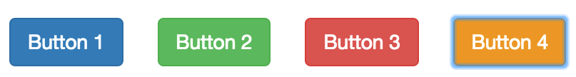

Your entire application should be accessible. I’m not going to go into why.
There are plenty of articles describing the wins. This is to describe one thing
that I did where I work that appeased our designer, but maintained
accessibility.

I’m talking about that nice blue outline browsers give you when an element
receives focus.

<figcaption>Button 4 has focus</figcaption>

This is great for people who are restricted to the keyboard or have difficulties
seeing, but designers hate it. “It doesn’t really match our style.”
