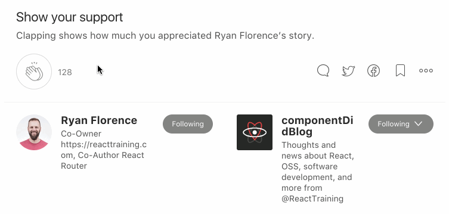

You can clap more than once for a medium post. No I’m serious. In fact, _you can
clap up to 50 times!_ And you don’t even have to tap/click on it 50 times, _you
can just press and hold_ on the clap icon and it’ll just keep clapping up to 50.

Like this one time, I was really impressed by
[a blog post](https://cdb.reacttraining.com/react-inline-functions-and-performance-bdff784f5578)
from my friend [Ryan Florence](https://medium.com/u/162352c45b6e), **so I just
clapped 50 times 👏** It was super satisfying, and
[I think he appreciated it](https://twitter.com/ryanflorence/status/916392628240793602).
You can even keep pressing on the clap icon after 50 and even though it wont
keep counting up your claps, it still has that cool animation which is
satisfying in a more personal way.

Just watch:

<figcaption>gif of me clapping 50 times for Ryan’s post</figcaption>

So the next time you encounter a Medium post that you like especially well, give
it a few more claps. And **if this blog post taught you anything** you didn’t
know already, then give it 50 claps. I think you’ll like it.

> 👏 👏 👏 👏 👏 👏 👏 👏 👏 👏 👏 👏 👏 👏 👏 👏 👏 👏 👏 👏 👏 👏 👏 👏 👏 👏
> 👏 👏 👏 👏 👏 👏 👏 👏 👏 👏 👏 👏 👏 👏 👏 👏 👏 👏 👏 👏 👏 👏 👏 👏

> [5 hops this time](https://www.youtube.com/watch?v=wZv62ShoStY)

You friends, family, and dog 🐶 might not be aware of this, so I suggest you
share this on Twitter, Facebook, and Wooof.com. Or you can just retweet
[this](https://twitter.com/kentcdodds/status/920849976506421248):
