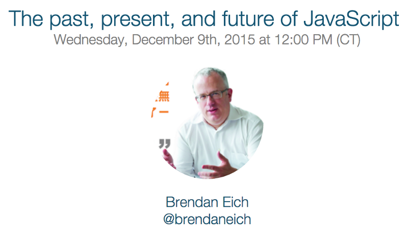
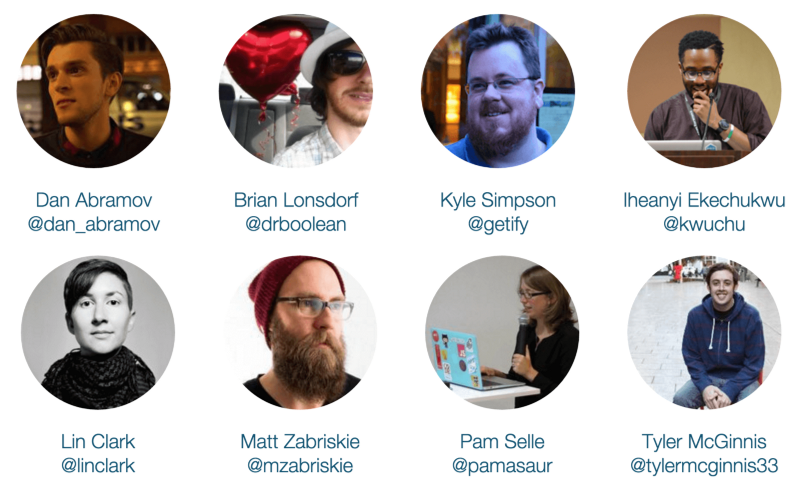

I’m pleased to announce [JavaScript Air](http://javascriptair.com)! This is a
live video broadcast podcast all about JavaScript and the web and the first
episode,
“[The past, present, and future of JavaScript](https://plus.google.com/events/c39cuc7ueppus41ajobpr9qt6cg),”
will be with [BrendanEich](https://medium.com/u/bcf2eaa79e8c). I couldn’t be
more stoked to have the original creator of JavaScript on for the first episode
of this new show.

Add the event to your calendar by RSVPing to
[the Google+ event](http://bit.ly/js-air-first).

<figcaption>[bit.ly/js-air-first](http://bit.ly/js-air-first)</figcaption>

#### How it works

Shows will air live using Hangouts on Air. The show will air regularly on
Wednesdays at [12:00 CST](http://www.thetimenow.com/time-zone-converter.php).
They will be available on [YouTube](http://video.javascriptair.com/) immediately
after the show and later published to an
[audio podcast](http://audio.javascriptair.com/) (available on
[iTunes](http://itunes.javascriptair.com)). We’ll be talking about anything
relating to the JavaScript and the web. Guest and topic
[suggestions welcome](http://issuetemplate.com/#/javascriptair/site/episode-suggestion)!

#### The People

The show is hosted by me ([Kent C. Dodds](https://twitter.com/kentcdodds)) and
is paneled by some of the coolest developers around (sorted alphabetically by
twitter handle of course).

- [Dan Abramov](https://twitter.com/dan_abramov)
- [Brian Lonsdorf](https://twitter.com/drboolean)
- [Kyle Simpson](https://twitter.com/getify)
- [Iheanyi Ekechukwu](https://twitter.com/kwuchu)
- [Lin Clark](https://twitter.com/linclark)
- [Matt Zabriskie](https://twitter.com/mzabriskie)
- [Pam Selle](https://twitter.com/pamasaur)
- [Tyler McGinnis](https://twitter.com/tylermcginnis33)

I’m super excited to have these fantastic people on the show with me and I look
forward to all of the awesome content we can deliver for the community!

#### Sponsors

[Egghead.io](https://egghead.io) is the premier sponsor for the show. Several of
the panelists (and me) have created content for Egghead. I recommend you go
check it out and subscribe to them. They’re awesome! If you or your company is
interested in sponsoring, please contact me:
[javascriptair@gmail.com](mailto:javascriptair@gmail.com)

#### Follow/Subscribe

Follow and/or subscribe and prepare for some wickedly awesome content!
[**Twitter**](https://twitter.com/JavaScriptAir)**,**
[**Google+**](https://plus.google.com/105493143005968326308)**,**
[**Facebook**](https://www.facebook.com/JavaScriptAir)**,**
[**YouTube**](http://video.javascriptair.com)**,**
[**iTunes**](http://itunes.javascriptair.com)**,**
[**RSS Feed**](http://audio.javascriptair.com/feed)

#### Brief History

A year ago [Todd Motto](https://twitter.com/toddmotto) and I started
[Angular Air](https://twitter.com/AngularAir). It’s been an awesome experience.
I recently decided that I could do more for the community by focusing more on
JavaScript. So I handed off management and ownership of Angular Air to
[Angular Class](https://angularclass.com/) and hosting to
[Jeff Whelpley](https://medium.com/u/d1d326dd6a28) and I’ll be focusing my
attention on JavaScript Air.

You can see the announcement in my last episode of Angular Air:
“[The Importance of Learning JavaScript](https://youtu.be/hWmNDlLrCI0)” with
[Kyle](https://medium.com/u/5dccb9bb4625) (the whole episode was awesome, but if
you just want to see the announcement, it was
[at the end](https://youtu.be/hWmNDlLrCI0?t=1h1m57s)).

#### Thanks!

I want to say thanks to everyone who’s supported me with Angular Air and
encouraged me to keep this going. I’m looking forward to helping provide the
community with high quality content to keep us all current and relevant in this
exciting fast-paced industry! See you around!

#### One more thing

If you thought this was interesting, you might like to
[check out the rest of my blog](https://blog.kentcdodds.com) and
[subscribe to my newsletter 💌](https://kcd.im/news) (newsletters are published
to my blog 2 weeks after they’re emailed out).

<figcaption>[TestingJavaScript.com](https://testingjavascript.com) Learn the smart, efficient way to test any JavaScript application.</figcaption>
