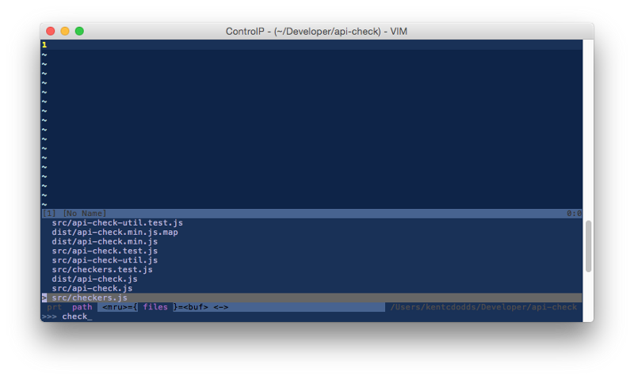

When you‘re going to create a new component (directive, service, etc.) you have
to make a decision. Maybe this decision has been made for you because you have a
set of file naming conventions. Conventions are helpful, but let’s make sure
that they make sense.

```````
angular
 .module(‘yourModule’)
 .directive(‘azFancyPants’, azFancyPants);
``````js
function azFancyPants() {
 return {/* your DDO */};
}
```````

What would you call this file?
([highlight](https://medium.com/the-story/introducing-highlights-a4df69e8ed43)
the one closest to your convention)

- azFancyPants.js
- azFancyPantsDirective.js
- azFancyPants.directive.js
- az-fancy-pants.js
- az-fancy-pants.directive.js
- other…. .js? (comment here)

For a _sane_ filename, I recommend _az-fancy-pants.js_. And here’s why…

> Name your file as you would see it in code

For example, for our _az-fancy-pants_ directive, we might see it in code like
so:

```jsx
<az-fancy-pants />
```

So, the name of the file should be: **_az-fancy-pants.js_**

Pretty much any reasonable editor or IDE you’re using probably has support for
fuzzy filename search and opening files by filename:



<figcaption>Vim [ctrlp plugin](https://github.com/kien/ctrlp.vim)</figcaption>


<figcaption>Webstorm [⌃⇧N](https://www.jetbrains.com/webstorm/help/navigating-to-class-file-or-symbol-by-name.html)</figcaption>


<figcaption>Atom [⌘ + P](https://atom.io/docs/latest/getting-started-atom-basics#opening-a-file-in-a-project)</figcaption>

… just show to name a few…

So, if I come across code that shows:

```jsx
<az-fancy-pants />
```

All I need to do is copy the directive name, open up my open file by name search
and paste the directive name and boom, I’m there. Same goes for
Services/Factories/etc. Just name the file after what you would see in the code.
(Note, in webstorm, you can actually hit ⌘ + B when your cursor is on a
directive and it should take you to the file that defines it. Mind blown 🔥).

Examples:

- SomethingAwesome (service/factory/etc.) → SomethingAwesome.js
- telephoneNumber (filter) → telephoneNumber.js
- really-cool-thing (directive) → really-cool-thing.js
- UnicornCtrl (controller) → UnicornCtrl.js
